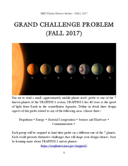

# SMU Honors Physics

# Table of Contents

* [Introduction](#introduction)
* [Fall 2017](#fall-2017-a-mission-to-an-exoplanet)

# Introduction

Since 2014, the SMU Department of Physics has provided an additiona zero-credit-hour section, added onto the introductory physics sequence (PHYS 1303/1304 or PHYS 1307/1308) to allow interested students to go above-and-beyond the standard intro physics environment. The course encourages learning through hands-on exploration of physical phenomena.

Starting in 2015, the course took on the following major components:

* Weekly engaged physics learning activities
 * Dropping a slinky suspended in the air and observing the bottom of the slinky to understand forces, acceleration due to gravity, acceleration due to stored energy in a spring, and center-of-mass.
 * Scratch-building cloud chambers to observe and study cosmic rays and their associated subatomic particle activity.
 * "The Zombie RC Circuit Survival Game": performed around Halloween, this pits students against the clock to finish constructing a series of RC circuits that are part of a putative electric fence designed to keep a hoard of zombies from reaching them. All must succeed in finishing their circits in the time limits, or all fail.
* Grand Challenge Physics problem
 * At the beginning of the semester, all students are divided into small teams and given an open-ended, non-textbook physics problem to spend the entire semester solving.
 * At the end of the semester, they present their work in a poster at an open poster night environment
 * Student progress is check-pointed throughout the semester in a series of "collaboration meeting" nights where teams present the state of their work, receive peer criticism and input, and mentor criticism and input.

In the Fall of 2017, we are adding a new component: a singular theme to unite the entire 15 weeks of the semester.

## Fall 2017: A Mission to an Exoplanet

Inspired by the "Breakthrough Starshot" project to develop a small probe to explore planet Proxima-B, 4 light-years away orbiting the star Proxima Centauri (c.f. [Guardian Science Weekly: Breakthrough Starshot: getting to Proxima Centauri b -- Science Weekly podcast](https://www.theguardian.com/science/audio/2017/apr/20/breakthrough-starshot-getting-to-proxima-centauri-b-science-weekly-podcast)), students will develop details ideas about a probe mission to one of the worlds of the [TRAPPIST-1 system](https://exoplanets.nasa.gov/trappist1/). This is a much more challenging problem, given the extreme distance between earth and TRAPPIST-1, but the diversity of its planets is likely more rich than that of Proxima Centauri and each planey may pose a unique challenge to a problem assuming that such a probe could ever successfully reach the system.

### Activities

* [Introduction to Python](python_basics/) - an awesome programming language
* [Adventures in Spacetime](AdventuresInSpacetime/) - learn about different kinds of numbers and understand what it means to have direction and magnitude. Vectors are essential to describing forces, acceleration, and velocity, which are all crucial in space travel and exploration.

# Acknowledgements

The content of this repository was authored by:

* [Eric Godat](https://github.com/egodat)
* [Stephen Sekula](https://github.com/stephensekula)
